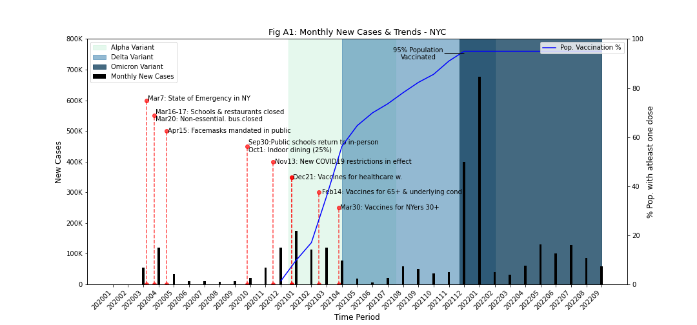
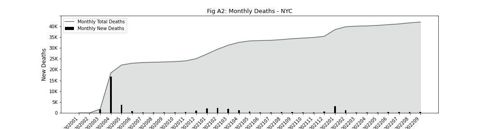

## Analysis of COVID19 Trends for NYC 
#### Project to analyze the spread and impact of COVID-19 in NYC

This independent research study utilizes CDC.gov data to explore the spread and impact of COVID-19 through NYC. Some of the questions asked in this study are - how and when COVID-19 spread through the city, how the different variants impacted us and what was the impact of the lockdowns, reopenings and vaccinations on the spread of the virus. Further, the study also explores if there are any commonalities in the health conditions associated with COVID related deaths. The relevant timeperiod is Jan 2020 to Sep 2022. 

### 
 Observations

The largest increase in new cases was seen in Dec 2021 through Jan 2022, which outpaces new case increases seen in any other period during the pandemic, including April 2020. 
   - While the data provided, does not indicate the type of variant asscoiated with each case, it is interesting to note that during this time period both the Delta variant and the Omnicron variant had been observed in US per [here](https://covariants.org/per-country?region=United+States&country=New+York&variant=20I+%28Alpha%2C+V1%29&variant=21A+%28Delta%29&variant=21I+%28Delta%29&variant=21J+%28Delta%29&variant=21K+%28Omicron%29&variant=21L+%28Omicron%29&variant=22A+%28Omicron%29&variant=22B+%28Omicron%29&variant=22C+%28Omicron%29&variant=22D+%28Omicron%29). 
   - Omicron is especially regarded as easily tranferrable and more infectious than prior variants which may have contributed to the increase in cases per the [CDC](https://www.cdc.gov/coronavirus/2019-ncov/variants/variant-classifications.html). 
   - However, it is also important to note the increased availability of testing resoures and compared to earlier in the pandemic which certainly contributed to an increase in recorded cases

Its interesting to see that while see large spikes in new cases later in the pandemic, these do not have corresponding large increases in new deaths. The largest spike in new deaths is seen at the start of the pandemic ~April 2022
   - We know that at the start of the pandemic, not a lot was known about the virus or appropriate treatment methods. 
   - At this time there was also extensive strain on medicals resources in the city and shortages in medical equipment and supplies. 
   - No vaccines were available at this time. Whereas nearly 95% of the NYC population had received atleast one dose of a COVID19 vaccine by YE2021
   
All these factors certainly contributed to the large number of deaths at the start of the pandemic.
