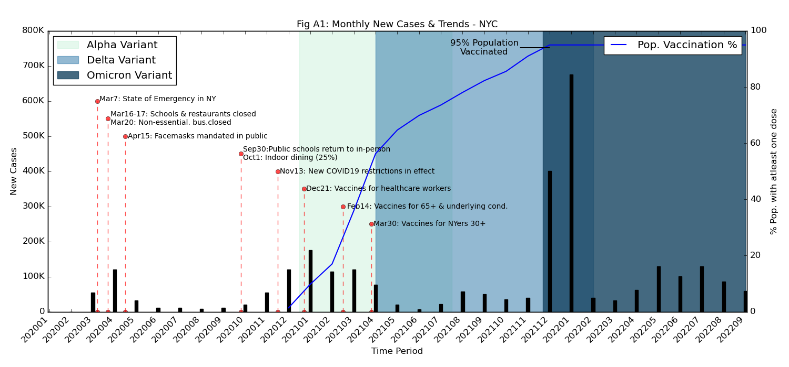
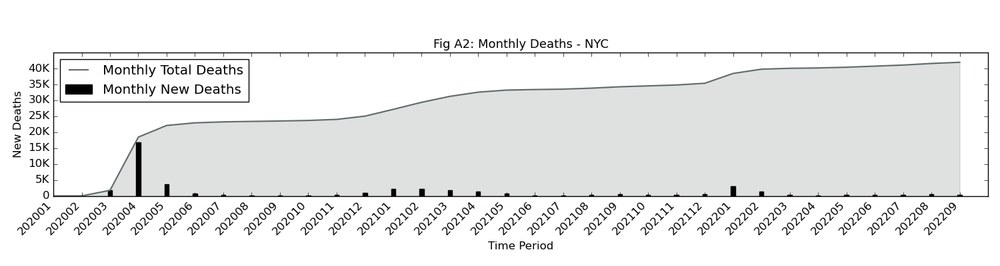
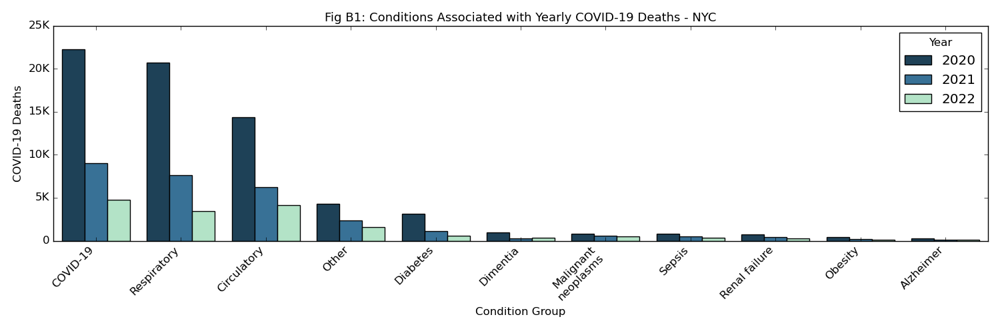
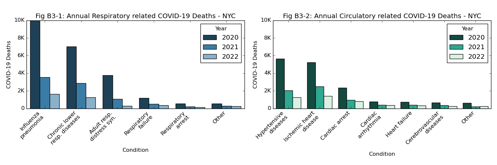

## Analysis of COVID19 Trends for NYC 

This independent research study utilizes CDC.gov data to explore the spread and impact of various COVID-19 variants through NYC. Some of the questions analyzed in this study are - spread and impact of the various COVID-19 variants, as well as the impact of lockdowns/reopenings and vaccinations on the spread of the virus. Further, the study also explores if there are any commonalities in the health conditions associated with COVID related deaths. 

The data for this study covers the timeperiod from Jan 2020 to Sep 2022 and has been limited to NYC. The output of this study is in the form of a research report ("Final Report") highlighting the key observations from the study

### Key Observations
#### New Cases and Trends

The largest increase in new cases was seen in Dec 2021 through Jan 2022, which outpaces new case increases seen in any other period during the pandemic, including April 2020. 
   - While the data provided does not indicate the type of variant asscoiated with each case, it is interesting to note that during this time period both the Delta variant and the Omnicron variant had been observed in US per [here](https://covariants.org/per-country?region=United+States&country=New+York&variant=20I+%28Alpha%2C+V1%29&variant=21A+%28Delta%29&variant=21I+%28Delta%29&variant=21J+%28Delta%29&variant=21K+%28Omicron%29&variant=21L+%28Omicron%29&variant=22A+%28Omicron%29&variant=22B+%28Omicron%29&variant=22C+%28Omicron%29&variant=22D+%28Omicron%29). 
   - Omicron is especially regarded as easily tranferrable and more infectious than prior variants which may have contributed to the increase in cases per the [CDC](https://www.cdc.gov/coronavirus/2019-ncov/variants/variant-classifications.html). 
   - However, it is also important to note the increased availability of testing resoures compared to earlier in the pandemic which certainly contributed to an increase in recorded cases.

Its also interesting to see that the large spikes in new cases observed later in the pandemic, do not have corresponding large increases in new deaths. The largest spike in new deaths is infact seen at the start of the pandemic ~April 2022.
   - We know that at the start of the pandemic, not a lot was known about the virus or appropriate treatment methods. 
   - At this time there was also extensive strain on medicals resources in the city and shortages in medical equipment and supplies. 
   - No vaccines were available at this time. Whereas nearly 95% of the NYC population had received atleast one dose of a COVID19 vaccine by YE2021.

#### Comorbidities Assciated with COVID-19 Deaths

There appear to be three main Conditions associated with COVID-19 related deaths in NYC - a generic "COVID-19" condition, as well as Respiratory and Circulatory related conditions. These trends do not change from 2020 to 2022 but, as expected, the number of deaths reduced over time.

<b>"COVID-19" Condition</b>: This group indicates those individuals where further information on underlying conditions does not exist or is unavailable (per dataset owners at the CDC). As seen in Fig B2 below, a majority of such cases were observed at the initial stages of the pandemic when not much was known about the virus ~April 2020.

<b>"Respiratory" and "Circulatory" Conditions</b>: The other primary conditions associated with COVID-19 deaths appear to be respiratory and circulatory. Given the nature of this virus, the concentration in respiratory conditions is to be expected but its interesting tosee a sizeable number of deaths associated with circulatory conditions. 

Further details on the underlying subconditions for each group are also shown below in Fig B3.

### References
* https://www.cdc.gov/
* https://en.wikipedia.org/wiki/Centers_for_Disease_Control_and_Prevention 
* https://apnews.com/article/how-long-covid-19-illness-last-476754619ef76504abd1d7722b4b50a6
* https://journals.plos.org/ploscompbiol/article?id=10.1371/journal.pcbi.1007007
* https://covariants.org
* https://www.nytimes.com/interactive/2021/health/coronavirus-variant-tracker.html
* https://www.cdc.gov/coronavirus/2019-ncov/variants/variant-classifications.html
* https://www.cnbc.com/2020/03/07/new-york-governor-andrew-cuomo-declares-state-of-emergency-over-coronavirus-outbreak.html
* https://www.governor.ny.gov/news/governor-cuomo-issues-guidance-essential-services-under-new-york-state-pause-executive-order
* https://www.governor.ny.gov/news/amid-ongoing-covid-19-pandemic-governor-cuomo-issues-executive-order-requiring-all-people-new
* https://en.wikipedia.org/wiki/COVID-19_pandemic_in_New_York_City
* https://web.archive.org/web/20200309082540/https://www.nytimes.com/2020/03/07/nyregion/coronavirus-new-york-queens.html
* https://www.investopedia.com/historical-timeline-of-covid-19-in-new-york-city-5071986
